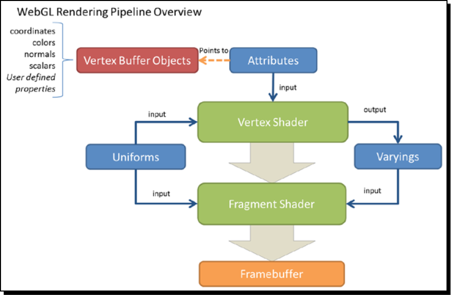

# WebGL Beginner's Guide

`WebGL` 是一种在浏览器上运行、不需要额外安装其他软件或插件的3D网页技术。

## Chapter 1: Getting Started with WebGL

`WebGL` 基于 `OpenGL ES 2.0(ES standing for Embedded Systems 嵌入式系统)` ，一种支持苹果得iPhone、iPad的特殊版本的 `OpenGL` 。但是作为特殊版本的进化版，`WebGL` 以提供便携式、跨平台和设备为目标称为独立的技术。

第一章：

* 理解 `WebGL` 应用的结构组成
* 设置画图区域 ` canvas ` 
* 测试浏览器 `WebGL` 的兼容性
* 理解 `WebGL` 作为状态机的作用
* 在场景中修改 `WebGL` 的变量
* 加载一个完整功能的场景

### 系统要求：

* FireFox4.0 及以上版本
* Google Chrome 11及以上版本
* Safari(OSX 10.6及以上版本)
* Opera 12及以上版本

### WebGL 提供的渲染功能

第一个区别：是否使用特殊的绘图硬件。基于软件渲染在3D场景中使用的是计算机的处理器，CPU；而基于硬件渲染的场景中使用的 `Graphics Processing Unit (GPU)` 。`harware-based rendering`方式更加有效，因为有专门的硬件处理图形绘画计算。`software-based` 方式渲染更普遍，因为不需要额外的处理器。

第二个区别：在local或remote渲染3D场景。当需要渲染的图像太过于复杂时，一般选择使用远程渲染。3D动画电影渲染过程需要大量的渲染服务器来渲染。我们把它称为 `server-based rendering` 。相反的本地渲染称为： `client-based rendering` 。

`WebGL` 和其他技术相比的优点：

- JavaScript Programming : `JavaScript` 允许你调用所有的DOM同时轻易实现两个元素间通信功能。同时能应用H5技术和 `jQuery` 等前端技术。
- Automatic memory management : 其他的技术可能会需要开发者自己管理内存，极可能造成内存泄露、溢出等情况。自动管理技术遵循变量作用域原则自动解除不需要的变量内存。
- Pervasiveness : 浏览器发展的机遇，在智能手机和平板设备的兼容性问题解决的很好。
- Performance : WebGL应用在性能上能和独立桌面应用一较高下(也有列外)。现在很多3D web 渲染依然依靠 `soft-based render` 的方式
- Zero compilation : WebGL 使用 `JavaScript` 语言，在浏览器上运行前不需要提前编译。

###  WebGL应用的结构

* Canvas : 这是一个场景渲染的占位符 `placeholder` 。是一个标准的H5页面元素
* Objects : 组成3D场景的实体。实体是由很多的三角形组成( `triangles` )。
* Lights : 没有灯光的话，在场景里什么也看不见。
* Camera : canvas就是一个3D世界，Camera就是我们观察这个世界的视口。

### 创建一个 HTML5 canvas

```html
<!doctype html>
<html lang="en">
<head>
  <meta charset="UTF-8">
  <title>WebGL beginner' Guide : Setting up the canvas</title>
  <style>
    canvas {
      border: 2px dotted blue;
    }
  </style>
</head>
<body>
  <canvas id="canvas-element-id" width="800" height="600"></canvas>
</body>
</html>

```

### canvas attributes

* id : DOM 结构的身份id
* width and height : 这俩属性定义了canvas的大小。如果没有定义这两个属性，在Firefox、Chrome和WebKit默认使用 `300 * 150` 大小。

### what if the canvas is not supported?

```html
<canvas>Your browser does not support HTML5 canvas</canvas>
```

### Accessing a WebGL context

`WebGL context` 是一个句柄，通过这个句柄我们能使用 `WebGL` 的功能和属性。这些构成了 `WebGL` 的  `Application Program Interface(API) ` 。

### WebGL is a state machine

`WebGL context` 可以被理解成 `状态机` ：一旦你修改了某个属性，那这个修改就是永久的，直到你再次修改。下面的代码解释

```html
<!doctype html>
<html lang="en">
<head>
  <meta charset="UTF-8">
  <title>WebGL Beginner's Guide - Setting up WebGL context</title>
  <style>
    canvas {
      border: 2px dotted blue;
    }
  </style>
  <script>
    let gl = null;
    let c_width = 0;
    let c_height = 0;
    window.onkeydown = checkKey;
    function checkKey(ev) {
      switch (ev.keyCode) {
        case 49: { //1
          gl.clearColor(0.3, 0.7, 0.2, 1.0);
          clear(gl);
          break;
        }
        case 50: { //2
          gl.clearColor(0.3, 0.2, 0.7, 1.0);
          clear(gl);
          break;
        }
        case 51: { //3
          const color = gl.getParameter(gl.COLOR_CLEAR_VALUE);
          alert('clearColor = (' +
            Math.round(color[0] * 10) /10 + ',' +
            Math.round(color[1] * 10) /10 + ',' +
            Math.round(color[2] * 10) / 10 + ')');
          window.focus();
          break;
        }
      }
    }
    function getGLContext() {
      const canvas = document.getElementById('canvas-element-id');
      if(canvas === null) {
        alert('there is no canvas on this page ');
        return;
      }
      const ctx = canvas.getContext('webgl');
      if(!ctx) {
        alert('WebGL is not available');
      } else {
        return ctx;
      }
    }
    function clear(ctx) {
      ctx.clear(ctx.COLOR_BUFFER_BIT);
      ctx.viewport(0, 0, c_width, c_height);
    }
    function initWebGL() {
      gl = getGLContext();
    }
  </script>
</head>
<body onload="initWebGL()">
<canvas id="canvas-element-id" width="800" height="600">Your browser doesn't appear support the HTML5 <code>&lt;canvas&gt;</code> element.</canvas>
</body>
</html>
```

有四个函数：

|   Function   | Description                                                  |
| :----------: | :----------------------------------------------------------- |
|   checkKey   | 监听键盘输入                                                 |
| getGLContext | 获取 `WebGL context` 句柄，返回值为空时表示不支持 `WebGL`    |
|    clear     | `WebGL context` 的一个属性，将画布清除为当前清除的颜色。如前所述，`WebGL` 理解为状态机，因此它会一直维持选中的颜色，直到使用 `WebGL function gl.clearColor()` |
|  initWebGL   | 网页初始化的方法                                             |

### Loading a 3D scene

虚拟 WebGL Car Scene

1. 打开ch1_Car.html 
2. 第二章渲染几何(rendering Geometry)教你如何渲染这个car模型
3. 使用侧边栏动态的修改模型属性
4. 点击、拖拽旋转car和调整car的视角

场景中由以下内容组成：

* A canvas 
* A series of polygonal meshes (Object) that constitute the car: roof, windows, headlights, fenders, doors, wheels， and so on
* Light sources
* A camera that determines where in the 3D world is our view point

## Chapter 2 : Rendering Geometry

`WebGL` 渲染文件遵循 `divide and conquer` 方法。每个多边形都可以分解成三角形、线、和点 基元。

第二章：

* 理解 `WebGL` 定义和执行几何信息
* 讨论相关的API
* 测试使用JSON文件定义、存储和加载复杂的几何体
* 继续分析 `WebGL` 作为一个状态机存储动态属性的过程
* 创建和加载不同的几何模型

### Vertices and Indices (顶点和指数)

`WebGL` 使用标准方法处理几何数，有两个数据类型是基础的几何代表组成任意的3D模型：Vertices、Indices

**Vertices** 是定义3D模型的角(定点数)。每个顶点是由三维坐标来表示：(x, y, z)。`WebGL` 没有提供任何API方法来独立的通过管道穿过顶点。所以我们必须将我们需要的所有顶点定义在JavaScript Array中，再构建 `WebGL` 顶点。

**Indices** 是3D场景的数字标签。它告诉 `WebGL` 产生平面应该怎么链接顶点。就像 `Vertices` 一样，`indices` 也要被定义在 JavaScript Array中

### WebGL绘制流程 

### 

#### Vertex Buffer Objects(VBOs)

VBOs包含 `WebGL` 要渲染需要的顶点数据。其他的集中数据类型也可以存储在VBOs中：vertex normals, colors, and textture coordinates 等。

#### Vertex shader

